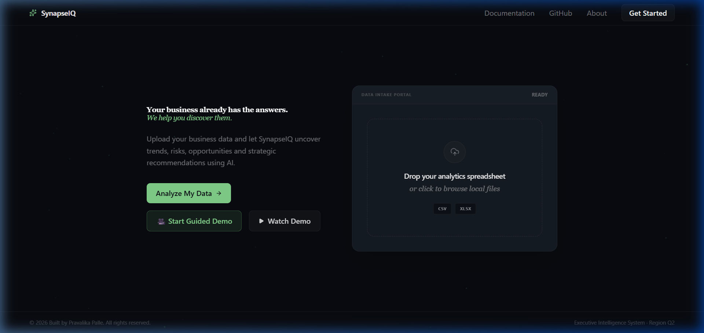
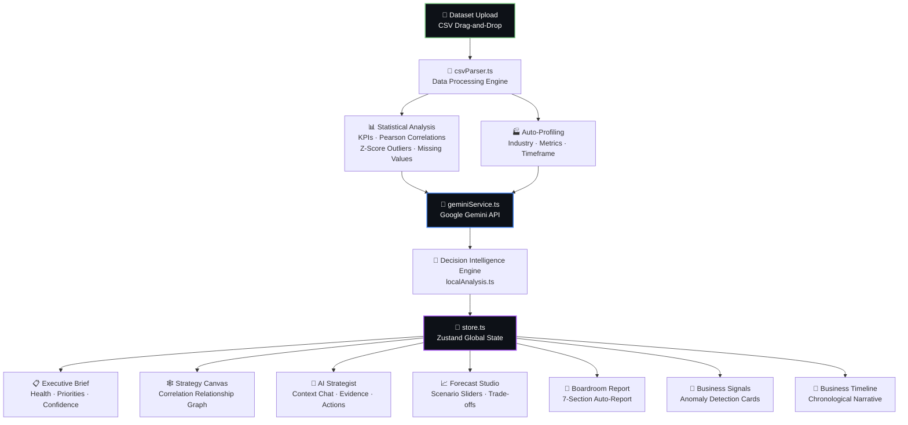
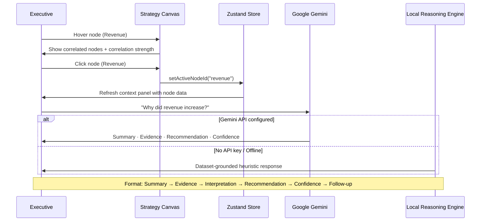
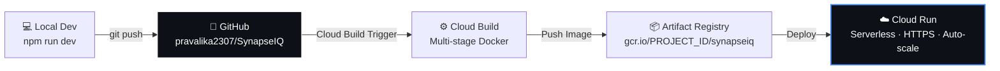
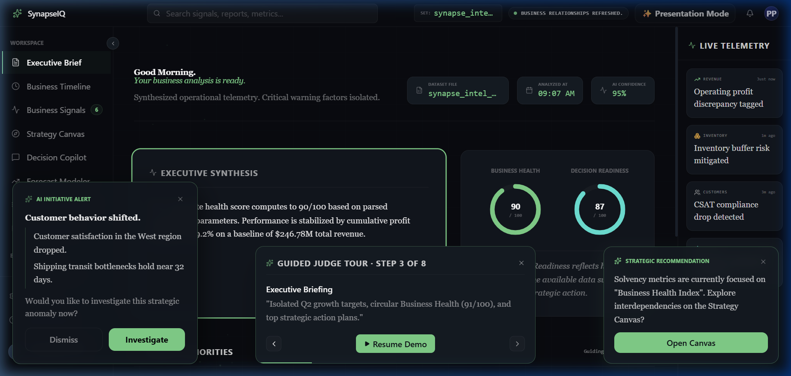
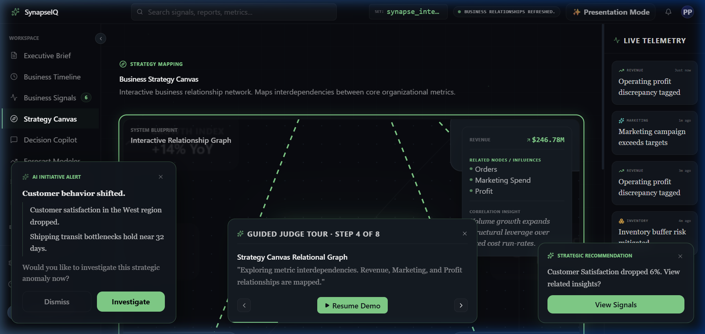
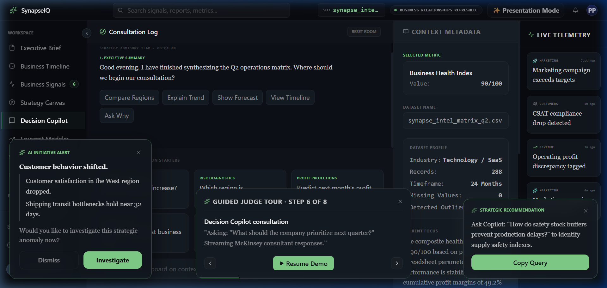
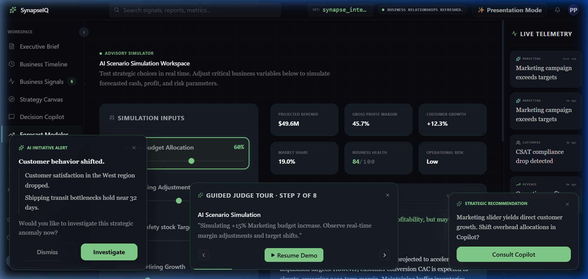
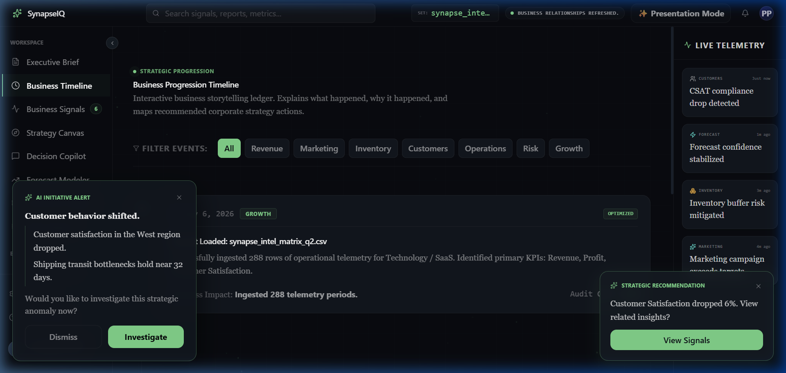
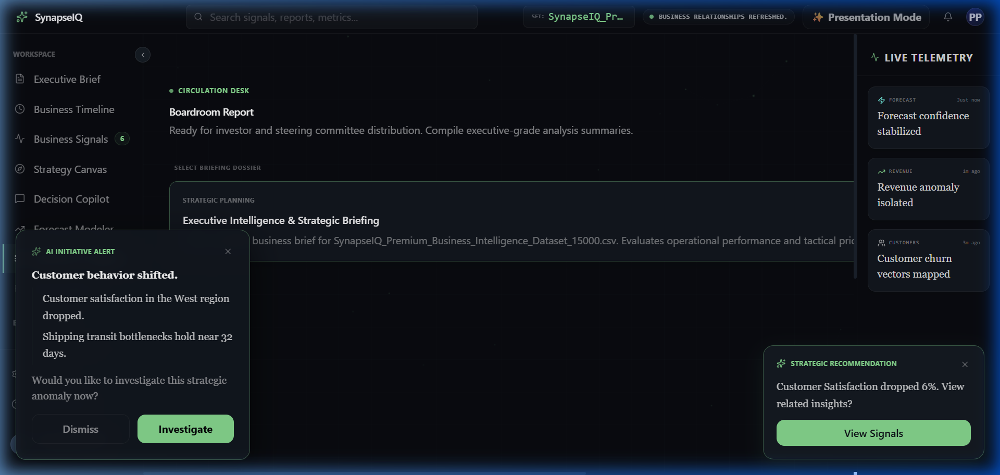

<div align="center">

<br />

# ⚡ SynapseIQ

### *Where Data Becomes Decisions*

**AI Operating System for Executive Decision Making**

<br />

> 🏆 **Built for Google GenAI Academy Hackathon 2026**

<br />

[](https://react.dev)
[](https://www.typescriptlang.org)
[](https://vite.dev)
[](https://tailwindcss.com)
[](https://ai.google.dev)
[](./LICENSE)

<br />

[](https://developers.google.com/learn/topics/genai)
[](./package.json)
[](./CHANGELOG.md)
[](./Dockerfile)

<br />

---

### 🎥 [Watch Demo](#-demo) &nbsp;·&nbsp; 🚀 [Live App](#️-deployment) &nbsp;·&nbsp; 📄 [Presentation](#-demo) &nbsp;·&nbsp; 📚 [Documentation](#-table-of-contents)

---

</div>

<br />

<div align="center">



*Landing Portal — Drag-and-drop CSV intake with automatic business profiling*

</div>

<br />

<div align="center">

| ⚡ Intelligent Dataset Analysis | 🧠 Google Gemini Powered | 📊 8 AI-Driven Modules | 📑 Automated Executive Reports | ☁️ Cloud Run Ready |
|:---:|:---:|:---:|:---:|:---:|
| Profiles industry, KPIs, outliers | Live AI reasoning + offline fallback | End-to-end decision intelligence | Boardroom-ready in one click | Production Docker + Nginx |

</div>

<br />

---

## 📋 Table of Contents

- [Overview](#-overview)
- [Why SynapseIQ?](#-why-synapseiq)
- [Key Features](#-key-features)
- [Architecture](#-architecture)
- [Technology Stack](#️-technology-stack)
- [Project Structure](#-project-structure)
- [Screenshots](#-screenshots)
- [Demo](#-demo)
- [Getting Started](#-getting-started)
- [Environment Variables](#-environment-variables)
- [Deployment](#️-deployment)
- [Roadmap](#-roadmap)
- [Team](#-team)
- [License](#-license)

<br />

---

## 🌐 Overview

**SynapseIQ** is an AI-powered **Decision Intelligence Platform** that transforms structured business datasets into executive-ready insights, strategic recommendations, interactive business relationship maps, forecasting simulations, and boardroom-ready reports — all powered by **Google Gemini**.

Unlike traditional BI dashboards that passively display charts, SynapseIQ acts as a **living AI operating system** that proactively surfaces strategic narratives, detects anomalies, simulates business scenarios, and guides executives toward high-confidence decisions.

> *"This isn't another analytics tool. This is an AI strategist embedded inside your business data."*

<br />

---

## 🆚 Why SynapseIQ?

| Capability | Traditional Business Intelligence | ⚡ SynapseIQ |
|---|---|---|
| **Output** | Static charts and dashboards | Executive decisions and strategic recommendations |
| **Analysis** | Shows *what* happened | Explains *why* it happened + what to do next |
| **Reporting** | Manual, hours-long process | Auto-generated boardroom reports in seconds |
| **AI Integration** | Generic chatbot widget | Context-aware strategist with full dataset awareness |
| **Insights** | Reactive — discovered after damage | Proactive — AI Initiative Cards surface issues first |
| **Scenarios** | Not possible | Live scenario simulation with real-time trade-off analysis |
| **Relationships** | Siloed metric views | Interactive correlation graph (Strategy Canvas) |
| **Confidence** | No quality signals | Dynamic AI confidence scoring per dataset |
| **Data Limits** | Silent failures | Honest AI declarations when data is insufficient |
| **Deployment** | Enterprise software license | Open-source, Docker-ready, Cloud Run in minutes |

<br />

---

## ✨ Key Features

<table>
<tr>
<td width="50%">

### 📊 Executive Brief
AI-narrated business health summary with today's strategic priorities, top opportunities, critical risks, and dynamic confidence scoring — built for immediate boardroom consumption.

</td>
<td width="50%">

### 🧠 Strategy Canvas
Interactive React Flow relationship graph that maps mathematical correlations between Revenue, Profit, Marketing ROI, Inventory, and Customer Satisfaction. Hover any node for correlation strength and strategic insight.

</td>
</tr>
<tr>
<td width="50%">

### 📡 Business Signals
Real-time anomaly telemetry matrix detecting meaningful business events — revenue-profit divergence, satisfaction drops, inventory pressure, and marketing ROI outliers — with McKinsey-style explanations.

</td>
<td width="50%">

### 🤖 AI Strategist (Decision Copilot)
Gemini-powered split-pane consulting interface delivering structured executive responses: **Summary → Evidence → Interpretation → Recommendation → Confidence → Follow-up**.

</td>
</tr>
<tr>
<td width="50%">

### 📈 Forecast Studio
Six-lever scenario simulator — Marketing, Pricing, Inventory, Hiring, Retention, Costs — with real-time AI trade-off analysis and projected revenue, margin, and risk scoring.

</td>
<td width="50%">

### 📅 Business Timeline
Chronological narrative ledger translating raw dataset records into a human-readable business story with category filtering and trend visualization.

</td>
</tr>
<tr>
<td width="50%">

### 📑 Boardroom Report
Seven-section auto-generated executive report: Executive Summary · Business Health · Key Opportunities · Critical Risks · Forecast · Strategic Recommendations · 90-Day Action Plan.

</td>
<td width="50%">

### 📂 Intelligent Dataset Upload
Upload any CSV business dataset. SynapseIQ auto-profiles the data: detects industry type, infers key business metrics, identifies missing values and Z-score outliers, and adapts all modules to your context.

</td>
</tr>
</table>

**Additional Capabilities:**
- 🎬 **AI Narrative Engine** — Full-screen animated narrative post-analysis guiding executives through key findings
- ✨ **Presentation Mode** — One-click projector-optimized interface with expanded spacing and focused layouts
- 🧭 **Guided Demo Tour** — Automated 3-minute walkthrough built for hackathon judges — no setup required
- 🔒 **Honest AI Declarations** — Clear diagnostic banners when data is insufficient; no hallucinated answers
- 🌐 **Intelligence Mesh** — Ambient animated particle background responding to data state changes

<br />

---

## 🏗 Architecture

### System Architecture — End-to-End Data Flow



> The CSV parser computes Pearson correlations, Z-score outliers (±3σ), and missing value ratios. This statistical profile feeds Google Gemini to generate a context-rich analysis JSON, which hydrates the Zustand global store powering every module simultaneously.

---

### AI Processing Pipeline — Decision Copilot



> Every AI response — whether from Gemini or the local fallback — follows the same structured executive format. The local reasoning engine uses computed KPI stats (mean, max, min, total) from the parsed dataset to provide data-grounded answers without an API key.

---

### Deployment Architecture — Google Cloud Run



> The multi-stage Dockerfile compiles the React SPA in a Node.js builder container, then serves static assets via a minimal Nginx Alpine image on port 8080 — ideal for Google Cloud Run's serverless container model.

<br />

---

## 🛠️ Technology Stack

### Frontend

| Technology | Version | Purpose |
|---|---|---|
| [React](https://react.dev) | 19.x | UI Component Framework |
| [TypeScript](https://typescriptlang.org) | 6.x Strict | Type Safety & Developer Experience |
| [Vite](https://vite.dev) | 8.x | Build Tool & Dev Server |
| [Tailwind CSS](https://tailwindcss.com) | v4 | Utility-first Dark Theme Styling |
| [Framer Motion](https://www.framer.com/motion) | 12.x | Animations & Page Transitions |
| [React Router](https://reactrouter.com) | v7 | Client-side Hash Routing |
| [Zustand](https://zustand-demo.pmnd.rs) | 5.x | Global Application State |

### AI & Data Intelligence

| Technology | Purpose |
|---|---|
| [Google Gemini API](https://ai.google.dev) | Executive briefs · Copilot chat · Scenario reasoning |
| Local Reasoning Engine | Offline heuristic analysis grounded in computed dataset statistics |
| Pearson Correlation Engine | Business metric relationship mapping for Strategy Canvas |
| Z-Score Outlier Detection | Statistical anomaly identification (±3σ threshold) |
| Dynamic Confidence Scoring | AI quality index based on dataset completeness and outlier density |

### Visualization

| Technology | Version | Purpose |
|---|---|---|
| [React Flow (xyflow)](https://reactflow.dev) | 12.x | Interactive Strategy Canvas node graph |
| [Recharts](https://recharts.org) | 3.x | Business charts, scatter plots, line charts |

### Infrastructure

| Technology | Purpose |
|---|---|
| [Docker](https://docker.com) | Multi-stage production container (Node builder → Nginx Alpine) |
| [Nginx](https://nginx.org) | Static SPA serving with hash-router fallback rules |
| [Google Cloud Run](https://cloud.google.com/run) | Serverless HTTPS container deployment |
| [Google Cloud Build](https://cloud.google.com/build) | CI/CD from GitHub to Artifact Registry |

<br />

---

## 📁 Project Structure

```
SynapseIQ/
│
├── Dockerfile                  # Multi-stage production container
├── nginx.conf                  # SPA routing + static serving config
├── package.json                # NPM manifest (v1.0.0)
├── tsconfig.json               # TypeScript strict configuration
├── vite.config.ts              # Vite build configuration
├── CHANGELOG.md                # Version history
├── CONTRIBUTING.md             # Contribution guidelines
├── SECURITY.md                 # Security policy
│
├── docs/
│   └── screenshots/            # README screenshots (7 pages)
│
├── public/
│   └── favicon.svg             # Application icon
│
└── src/
    ├── App.tsx                 # Root HashRouter + route definitions
    ├── main.tsx                # React DOM entry point
    ├── index.css               # Global design tokens + Tailwind
    │
    ├── components/             # Shared UI components
    │   ├── ui/                 # Atomic design system (Button, Card, Badge…)
    │   ├── DecisionGraph.tsx   # React Flow interactive relationship graph
    │   ├── AIMissionControl.tsx    # Animated AI narrative overlay
    │   ├── DemoController.tsx  # Guided demo tour state machine
    │   ├── IntelligenceMesh.tsx    # Ambient animated particle background
    │   ├── LiveInsightStream.tsx   # Live activity ticker sidebar
    │   ├── PresentationToolbar.tsx # Presentation mode toggle
    │   ├── Sidebar.tsx         # Collapsible navigation panel
    │   ├── Topbar.tsx          # Top bar + AI status indicators
    │   └── UploadZone.tsx      # CSV drag-and-drop upload
    │
    ├── features/               # Business logic & AI services
    │   ├── csvParser.ts        # CSV ingestion · profiling · correlation engine
    │   ├── data.ts             # Node context and telemetry data maps
    │   ├── defaultDataset.ts   # Built-in demo dataset (NovaRetail Q2)
    │   ├── demoStore.ts        # Guided tour Zustand state machine
    │   ├── geminiService.ts    # Google Gemini API integration
    │   ├── localAnalysis.ts    # Offline heuristic analysis engine
    │   └── store.ts            # Global application state (Zustand)
    │
    ├── layouts/
    │   └── DashboardLayout.tsx # Sidebar + Topbar shell wrapper
    │
    └── pages/                  # Full-page view components
        ├── Landing.tsx         # Upload portal + AI intake sequence
        ├── ExecutiveBrief.tsx  # Executive summary + health + priorities
        ├── BusinessTimeline.tsx    # Chronological event narrative
        ├── BusinessSignals.tsx # Anomaly telemetry matrix
        ├── StrategyCanvas.tsx  # Strategy graph + scatter analysis
        ├── DecisionCopilot.tsx # AI strategist chat interface
        ├── Forecast.tsx        # Scenario simulator + projections
        ├── Reports.tsx         # Boardroom report generator
        └── DataExplorer.tsx    # Raw dataset exploration viewer
```

<br />

---

## 📸 Screenshots

> All screenshots below show SynapseIQ running live with the built-in NovaRetail Q2 demo dataset. No API key is required for the demo experience.

<br />

<div align="center">

**Landing Portal — Intelligent Dataset Intake**


*Drag-and-drop CSV upload · Auto-profiling · Industry detection · Validation feedback*

</div>

<br />

<div align="center">

**Executive Brief — AI-Narrated Business Summary**



*Business Health Score 90/100 · Decision Readiness 87/100 · AI Confidence 95% · Strategic Priorities · Live Telemetry*

</div>

<br />

<div align="center">

**Strategy Canvas — Interactive Business Relationship Graph**



*Pearson correlation mapping · Revenue $246.78M · Node relationship tooltips · Animated edges*

</div>

<br />

<div align="center">

**AI Strategist — Context-Aware Decision Copilot**



*Gemini-powered executive chat · Dataset Profile panel · McKinsey response format · Confidence scoring*

</div>

<br />

<div align="center">

**Forecast Studio — Live Scenario Simulator**



*Six business levers · Projected Revenue $49.6M · Gross Margin 45.7% · Real-time AI trade-off analysis*

</div>

<br />

<div align="center">

**Business Timeline — Chronological Narrative Ledger**



*Event-driven business story · Category filter chips · Trend visualization · Seasonal dynamics*

</div>

<br />

<div align="center">

**Boardroom Report — Auto-Generated Executive Report**



*7-section executive brief · Strategic Planning dossier · Investor-ready format*

</div>

<br />

---

## 🎬 Demo

<div align="center">

| Resource | Link |
|---|---|
| 🎥 **Demo Video** | *Coming Soon — Upload to YouTube* |
| 🚀 **Live Deployment** | *Deploy to Google Cloud Run — see instructions below* |
| 📄 **Presentation Deck** | *Google Slides presentation link* |

</div>

### ▶️ Guided Demo Experience — For Hackathon Judges

SynapseIQ includes a built-in **Guided Demo Tour** that requires zero configuration.

1. Open the application — the built-in NovaRetail Q2 dataset loads automatically
2. Click **Start Guided Demo** on the landing screen
3. The system auto-navigates through all 8 key features with spotlights and narration
4. **Completes in under 3 minutes**

> **No Gemini API key required.** The guided demo uses an intelligent offline reasoning engine backed by pre-computed statistical analysis of the bundled dataset.

<br />

---

## 🚀 Getting Started

### Prerequisites

| Requirement | Version |
|---|---|
| Node.js | ≥ 20.x |
| npm | ≥ 10.x |
| Gemini API Key | Optional |

### Installation

```bash
# 1. Clone the repository
git clone https://github.com/pravalika2307/SynapseIQ.git
cd SynapseIQ

# 2. Install dependencies
npm install

# 3. Start the development server
npm run dev
```

Open [http://localhost:5173](http://localhost:5173) in your browser.

### Other Commands

```bash
# Type-check + compile production bundle
npm run build

# Preview the production build locally
npm run preview

# Run ESLint code quality checks
npm run lint
```

<br />

---

## 🔐 Environment Variables

SynapseIQ works **fully offline** with its built-in reasoning engine. A Gemini API key unlocks live AI capabilities.

| Variable | Required | Description |
|---|---|---|
| `GEMINI_API_KEY` | Optional | Google Gemini API key for live executive briefs and copilot chat |

**How to configure:** No `.env` file is required. Enter your Gemini API key directly in the app UI at the landing screen. The key is stored in browser session memory only and is never persisted or transmitted to any external server other than the Google Gemini API.

> **Privacy:** All data processing happens client-side in your browser. No dataset or business data leaves your device unless you explicitly enable Gemini API integration.

<br />

---

## ☁️ Deployment

### Google Cloud Run

```bash
# Authenticate
gcloud auth login
gcloud config set project YOUR_PROJECT_ID

# Build and push via Cloud Build
gcloud builds submit --tag gcr.io/YOUR_PROJECT_ID/synapseiq:latest

# Deploy to Cloud Run
gcloud run deploy synapseiq \
  --image gcr.io/YOUR_PROJECT_ID/synapseiq:latest \
  --platform managed \
  --region us-central1 \
  --allow-unauthenticated \
  --port 8080
```

### Docker (Local)

```bash
docker build -t synapseiq:latest .
docker run -p 8080:8080 synapseiq:latest
```

Open [http://localhost:8080](http://localhost:8080)

### Static Hosting (Vercel / Netlify)

```bash
npm run build
# Deploy the dist/ directory — no server-side requirements
```

<br />

---

## 🔮 Roadmap

| Status | Version | Milestone |
|---|---|---|
| ✅ Complete | v1.0.0 | Hackathon Prototype — Full AI decision platform with Gemini |
| 🔄 In Progress | v1.1 | Real-time analytics via WebSocket streaming |
| 📅 Planned | v1.2 | Multi-user collaborative workspaces with role-based access |
| 📅 Planned | v1.3 | ERP connectors — SAP, Oracle NetSuite, Microsoft Dynamics |
| 📅 Planned | v1.4 | CRM connectors — Salesforce, HubSpot, Pipedrive |
| 📅 Planned | v2.0 | Explainable AI with full causal reasoning chains |
| 📅 Planned | v2.1 | Enterprise SSO — Google Workspace, Okta, Azure AD |
| 📅 Planned | v2.2 | One-click PowerPoint and PDF boardroom export |
| 🌟 Vision | v3.0 | Google Vertex AI integration with custom fine-tuned models |

<br />

---

## 👤 Team

<div align="center">

<br />

**Pravalika Palle**

*Lead Engineer · Product Designer · AI Architect*

MCA Graduate · AI & Data Enthusiast · Builder of SynapseIQ

[](https://github.com/pravalika2307)

<br />

</div>

---

## 📄 License

This project is licensed under the **MIT License** — see the [LICENSE](./LICENSE) file for details.

Copyright © 2026 Pravalika Palle

<br />

---

<div align="center">

<br />

**⚡ SynapseIQ**

*Where Data Becomes Decisions*

AI Operating System for Executive Decision Making

Powered by Google Gemini · Built for Google GenAI Academy Hackathon 2026

<br />

*If you found this project interesting, please consider giving it a ⭐ on GitHub.*

<br />

[⬆ Back to Top](#-synapseiq)

</div>
