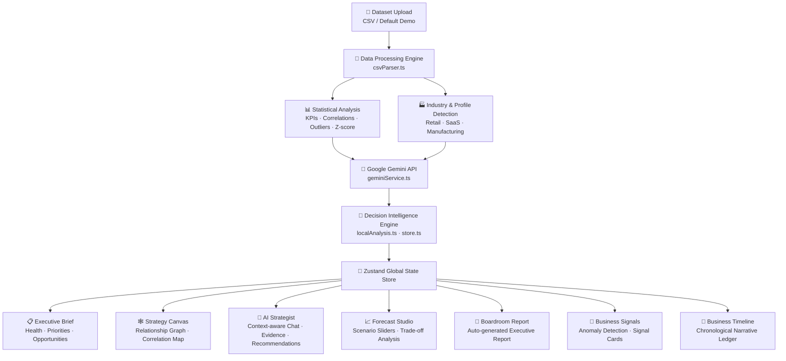
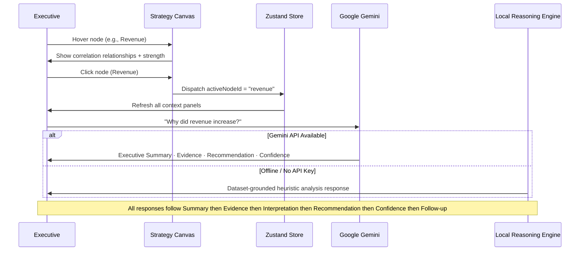
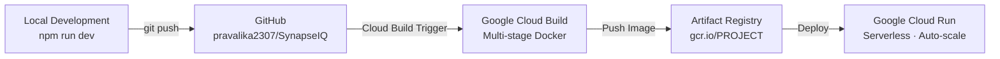

<div align="center">

<br />

# ⚡ SynapseIQ

### *Where Data Becomes Decisions*

**AI Operating System for Executive Decision Making**

<br />

[](https://react.dev)
[](https://www.typescriptlang.org)
[](https://vite.dev)
[](https://tailwindcss.com)
[](https://ai.google.dev)
[](./LICENSE)

<br />

[](https://developers.google.com/learn/topics/genai)
[](./package.json)
[](./CONTRIBUTING.md)
[](./CHANGELOG.md)

<br />

---

### 🎥 [Watch Demo](#-demo) &nbsp;·&nbsp; 🚀 [Live App](#-deployment) &nbsp;·&nbsp; 📄 [Presentation](#-demo) &nbsp;·&nbsp; 📚 [Documentation](#-table-of-contents)

---

</div>

<br />

## 📋 Table of Contents

- [Overview](#-overview)
- [Problem Statement](#️-problem-statement)
- [Key Features](#-key-features)
- [Architecture](#-architecture)
- [Technology Stack](#-technology-stack)
- [Project Structure](#-project-structure)
- [Screenshots](#-screenshots)
- [Demo](#-demo)
- [Getting Started](#-getting-started)
- [Environment Variables](#-environment-variables)
- [Deployment](#️-deployment)
- [Roadmap](#-roadmap)
- [Contributing](#-contributing)
- [Team](#-team)
- [License](#-license)

<br />

---

## 🌐 Overview

**SynapseIQ** is an AI-powered **Decision Intelligence Platform** that transforms structured business datasets into executive-ready insights, strategic recommendations, interactive business relationships, forecasting simulations, and boardroom-ready reports — all powered by **Google Gemini**.

Unlike traditional BI dashboards that passively display charts, SynapseIQ acts as a **living AI operating system** that proactively surfaces strategic narratives, detects anomalies, simulates business scenarios, and guides executives toward high-confidence decisions.

> *"This isn't another analytics tool. This is an AI strategist embedded inside your business data."*

<br />

---

## ⚠️ Problem Statement

Modern enterprises operate with fragmented insight pipelines:

| Challenge | Impact |
|---|---|
| **The "What vs Why" Gap** | Tools show *what* changed but never explain *why* it happened |
| **Untestable Decisions** | Executives make multi-million dollar pivots without a risk sandbox |
| **Context-Free AI** | Generic chatbots that lack page and metric awareness |
| **Report Paralysis** | Hours spent manually compiling boardroom presentations |
| **Reactive Operations** | Businesses discover issues after damage is already done |

SynapseIQ eliminates each of these with a unified, AI-native decision surface.

<br />

---

## ✨ Key Features

<table>
<tr>
<td width="50%">

### 📊 Executive Brief
The dashboard begins with an AI-narrated executive summary. Business health scores, top opportunities, critical risks, and today's strategic priorities are presented in a clean boardroom-ready layout with animated data ingestion.

</td>
<td width="50%">

### 🧠 Strategy Canvas
An interactive relationship graph — powered by React Flow — visualizes how core business metrics (Revenue, Profit, Marketing ROI, Inventory, Customer Satisfaction) are mathematically correlated. Hover over any node to see correlation strength and strategic explanations.

</td>
</tr>
<tr>
<td width="50%">

### 📡 Business Signals
A real-time telemetry matrix that detects and surfaces meaningful business events: revenue-profit divergence, satisfaction drops, inventory pressure, and marketing ROI outliers — with McKinsey-style explanations for each signal.

</td>
<td width="50%">

### 🤖 AI Strategist (Decision Copilot)
A split-pane AI consulting interface powered by Google Gemini. Ask questions about your dataset in natural language and receive structured executive responses: **Summary → Evidence → Interpretation → Recommendation → Confidence → Follow-up**.

</td>
</tr>
<tr>
<td width="50%">

### 📈 Forecast Studio
A live scenario simulator with intuitive sliders for Marketing Spend, Pricing, Inventory, Hiring, Customer Retention, and Operational Costs. The AI explains trade-offs in real time as parameters change, generating projected revenue, profit margin, and risk scores.

</td>
<td width="50%">

### 📅 Business Timeline
A chronological narrative ledger that translates raw dataset events into a human-readable business story. Filter by category, explore growth patterns, and understand seasonal dynamics at a glance.

</td>
</tr>
<tr>
<td width="50%">

### 📑 Boardroom Report
Auto-generates a full executive report with structured sections: Executive Summary, Business Health, Key Opportunities, Critical Risks, Forecast, Strategic Recommendations, and 90-Day Action Plan — formatted for immediate board presentation.

</td>
<td width="50%">

### 📂 Intelligent Dataset Upload
Upload any CSV business dataset. SynapseIQ automatically profiles the data: detects industry, infers key business metrics, identifies missing values and statistical outliers, and adapts all analysis modules to your specific data context.

</td>
</tr>
</table>

<br />

### Additional Platform Capabilities

- 🎬 **AI Narrative Engine** — Full-screen animated narrative after analysis completes, guiding executives through key findings
- 🌐 **Intelligence Mesh Background** — Ambient animated particle system that responds to data state changes
- ✨ **Presentation Mode** — One-click clean mode optimized for projector display and hackathon judging
- 🧭 **Guided Demo Tour** — Automated step-by-step product walkthrough for evaluators with no setup required
- 🔒 **Honest AI Declarations** — When data is insufficient, SynapseIQ clearly states limitations instead of hallucinating
- 📊 **Dynamic Confidence Scoring** — AI confidence adapts based on dataset completeness, outlier density, and column availability

<br />

---

## 🏗 Architecture

### System Architecture



### AI Workflow — Decision Copilot



### Deployment Architecture



<br />

---

## 🛠 Technology Stack

### Frontend

| Technology | Version | Purpose |
|---|---|---|
| [React](https://react.dev) | 19.x | UI Component Framework |
| [TypeScript](https://typescriptlang.org) | 6.x Strict | Type Safety & Developer Experience |
| [Vite](https://vite.dev) | 8.x | Build Tool & Dev Server |
| [Tailwind CSS](https://tailwindcss.com) | v4 | Utility-first Dark Theme Styling |
| [Framer Motion](https://www.framer.com/motion) | 12.x | Animations & Page Transitions |
| [React Router](https://reactrouter.com) | v7 | Client-side Routing |

### State Management

| Technology | Version | Purpose |
|---|---|---|
| [Zustand](https://zustand-demo.pmnd.rs) | 5.x | Global Application State |

### AI & Intelligence

| Technology | Purpose |
|---|---|
| [Google Gemini API](https://ai.google.dev) | Executive briefs · Copilot responses · Scenario analysis |
| Local Reasoning Engine | Offline-capable heuristic fallback AI |
| Z-Score Outlier Detection | Statistical anomaly identification |
| Pearson Correlation Analysis | Business metric relationship mapping |

### Data Visualization

| Technology | Version | Purpose |
|---|---|---|
| [React Flow (xyflow)](https://reactflow.dev) | 12.x | Interactive Strategy Canvas graph |
| [Recharts](https://recharts.org) | 3.x | Business charts & visualizations |

### Deployment & Infrastructure

| Technology | Purpose |
|---|---|
| [Docker](https://docker.com) | Multi-stage containerization |
| [Nginx](https://nginx.org) | Static SPA serving with fallback routing |
| [Google Cloud Run](https://cloud.google.com/run) | Serverless container deployment |
| [Google Cloud Build](https://cloud.google.com/build) | CI/CD pipeline automation |

<br />

---

## 📁 Project Structure

```
SynapseIQ/
│
├── Dockerfile                  # Multi-stage production container image
├── nginx.conf                  # SPA routing fallback + static serving config
├── package.json                # NPM manifest, scripts, and dependencies
├── tsconfig.json               # TypeScript compiler configuration
├── vite.config.ts              # Vite build and plugin configuration
├── .prettierrc                 # Code formatting rules
│
├── public/
│   └── favicon.svg             # Application icon (SVG)
│
└── src/
    ├── App.tsx                 # Root router — HashRouter + route definitions
    ├── main.tsx                # React DOM entry point
    ├── index.css               # Global design tokens + Tailwind directives
    │
    ├── assets/
    │   └── hero.png            # Hero image asset
    │
    ├── components/             # Shared UI components
    │   ├── ui/                 # Atomic design system primitives
    │   │   ├── Badge.tsx       # Status and label badges
    │   │   ├── Button.tsx      # Tactile interactive buttons
    │   │   ├── Card.tsx        # Content card wrappers
    │   │   ├── ChartContainer.tsx  # Recharts wrapper with animations
    │   │   ├── CountUp.tsx     # Animated number counter
    │   │   ├── Dropdown.tsx    # Select dropdown component
    │   │   ├── Input.tsx       # Form input fields
    │   │   ├── MetricCard.tsx  # KPI metric display cards
    │   │   └── SectionHeader.tsx   # Page section headers
    │   │
    │   ├── DecisionGraph.tsx   # React Flow interactive relationship graph
    │   ├── AIMissionControl.tsx    # Animated AI narrative engine overlay
    │   ├── DemoController.tsx  # Guided demo tour state machine
    │   ├── IntelligenceMesh.tsx    # Ambient animated particle background
    │   ├── LiveInsightStream.tsx   # Live activity sidebar ticker
    │   ├── PageTransition.tsx  # Route transition animations
    │   ├── PresentationToolbar.tsx # Presentation mode toggle + controls
    │   ├── Sidebar.tsx         # Collapsible navigation sidebar
    │   ├── Topbar.tsx          # Top navigation bar + AI status indicators
    │   └── UploadZone.tsx      # CSV drag-and-drop upload component
    │
    ├── features/               # Core business logic and AI services
    │   ├── csvParser.ts        # CSV ingestion · profiling · correlation engine
    │   ├── data.ts             # Node context and telemetry data mappings
    │   ├── defaultDataset.ts   # Built-in demo dataset (NovaRetail Q2)
    │   ├── demoStore.ts        # Guided tour Zustand state machine
    │   ├── geminiService.ts    # Google Gemini API integration layer
    │   ├── localAnalysis.ts    # Offline heuristic analysis engine
    │   └── store.ts            # Global application state (Zustand)
    │
    ├── layouts/
    │   └── DashboardLayout.tsx # Sidebar + Topbar shell layout wrapper
    │
    ├── pages/                  # Full-page view components
    │   ├── Landing.tsx         # Upload portal + AI intake sequence
    │   ├── ExecutiveBrief.tsx  # Executive summary · health · priorities
    │   ├── BusinessTimeline.tsx    # Chronological event narrative ledger
    │   ├── BusinessSignals.tsx # Anomaly telemetry signal matrix
    │   ├── StrategyCanvas.tsx  # Strategy graph + scatter analysis
    │   ├── DecisionCopilot.tsx # AI strategist chat interface
    │   ├── Forecast.tsx        # Scenario simulator + projections
    │   ├── Reports.tsx         # Boardroom executive report generator
    │   └── DataExplorer.tsx    # Raw dataset exploration viewer
    │
    └── types/                  # Shared TypeScript type definitions
```

<br />

---

## 📸 Screenshots

> The following screenshots demonstrate SynapseIQ running with the built-in NovaRetail Q2 demo dataset. No API key is required for the demo experience.

<br />

**Landing Portal — Intelligent Dataset Intake**
> Drag-and-drop CSV upload with automatic data profiling, industry detection, and validation feedback.

<br />

**Executive Brief — AI-Narrated Business Summary**
> Business health score, today's strategic priorities, top opportunities, critical risks, and confidence scoring.

<br />

**Strategy Canvas — Interactive Business Relationship Graph**
> React Flow powered node graph showing mathematical correlations between Revenue, Profit, Marketing, Inventory, and Customer Satisfaction with correlation strength tooltips.

<br />

**AI Strategist — Context-Aware Decision Copilot**
> Split-pane Gemini-powered chat interface delivering structured executive responses with evidence, recommendation, and follow-up suggestions.

<br />

**Forecast Studio — Live Scenario Simulator**
> Interactive sliders for 6 business levers with real-time AI trade-off analysis and projected outcome scoring.

<br />

**Business Timeline — Chronological Narrative Ledger**
> Event-driven business story from dataset with category filtering and trend visualization.

<br />

**Boardroom Report — Auto-Generated Executive Report**
> Full structured executive report with 7 sections ready for immediate board presentation.

<br />

---

## 🎬 Demo

<div align="center">

| Resource | Link |
|---|---|
| 🎥 **Demo Video** | *Coming Soon — Upload to YouTube* |
| 🚀 **Live Deployment** | *Deploy to Google Cloud Run — see instructions below* |
| 📄 **Presentation Deck** | *Google Slides presentation link* |

</div>

### Guided Demo Experience

SynapseIQ includes a built-in **Guided Demo Tour** designed specifically for hackathon evaluators with limited time.

1. Launch the application and click **Start Guided Demo** on the landing screen
2. The system auto-navigates through every feature with mock data pre-loaded
3. Spotlights highlight relevant UI sections at each step
4. The complete tour runs in under **3 minutes**

> **No API key required.** The guided demo uses an intelligent offline reasoning engine with the bundled NovaRetail Q2 dataset.

<br />

---

## 🚀 Getting Started

### Prerequisites

- **Node.js** ≥ 20.x
- **npm** ≥ 10.x
- **Google Gemini API Key** *(optional — full offline mode is available without one)*

### Installation

```bash
# 1. Clone the repository
git clone https://github.com/pravalika2307/SynapseIQ.git
cd SynapseIQ

# 2. Install dependencies
npm install
```

### Running Locally

```bash
# Start the development server with hot-reload
npm run dev
```

Open [http://localhost:5173](http://localhost:5173) in your browser.

### Production Build

```bash
# Type-check + compile optimized production bundle
npm run build

# Preview the production build locally
npm run preview
```

### Linting

```bash
# Run ESLint code quality checks
npm run lint
```

<br />

---

## 🔐 Environment Variables

SynapseIQ is designed to work **fully offline** with its built-in reasoning engine. A Gemini API key unlocks the full live AI capabilities.

| Variable | Required | Description |
|---|---|---|
| `GEMINI_API_KEY` | Optional | Google Gemini API key for live AI analysis and executive briefs |

### How to Configure

No `.env` file is required. The Gemini API key is entered directly in the application UI:

1. Launch the application
2. Upload a dataset (or use the built-in demo)
3. Enter your Gemini API key in the **API Key** field on the landing screen
4. The key is stored in browser session memory only — it is never transmitted to any external server

> **Privacy:** SynapseIQ processes all data client-side in your browser. No data is uploaded to any external service unless you explicitly provide a Gemini API key to enable live AI analysis.

<br />

---

## ☁️ Deployment

### Google Cloud Run (Recommended)

This project ships with a production-ready multi-stage `Dockerfile` and Nginx configuration optimized for Google Cloud Run.

```bash
# 1. Authenticate with Google Cloud
gcloud auth login
gcloud config set project YOUR_PROJECT_ID

# 2. Build and push container image via Cloud Build
gcloud builds submit --tag gcr.io/YOUR_PROJECT_ID/synapseiq:latest

# 3. Deploy to Cloud Run
gcloud run deploy synapseiq \
  --image gcr.io/YOUR_PROJECT_ID/synapseiq:latest \
  --platform managed \
  --region us-central1 \
  --allow-unauthenticated \
  --port 8080
```

### Docker (Local Container)

```bash
# Build the Docker image
docker build -t synapseiq:latest .

# Run the container
docker run -p 8080:8080 synapseiq:latest
```

Open [http://localhost:8080](http://localhost:8080)

### Static Hosting (Vercel / Netlify / GitHub Pages)

```bash
# Build production assets
npm run build

# Deploy the generated dist/ directory to your preferred static host
```

The `dist/` directory contains a fully self-contained SPA with no server-side requirements.

<br />

---

## 🔮 Roadmap

| Status | Version | Milestone | Description |
|---|---|---|---|
| ✅ Complete | v1.0.0 | **Hackathon Prototype** | Full-featured AI decision platform with Gemini integration |
| 🔄 In Progress | v1.1 | **Real-time Analytics** | WebSocket-powered live data streaming |
| 📅 Planned | v1.2 | **Multi-user Collaboration** | Shared workspaces with role-based permissions |
| 📅 Planned | v1.3 | **ERP Integration** | SAP, Oracle NetSuite, Microsoft Dynamics connectors |
| 📅 Planned | v1.4 | **CRM Integration** | Salesforce, HubSpot, and Pipedrive data ingestion |
| 📅 Planned | v2.0 | **Explainable AI** | Full causal reasoning chains with source citations |
| 📅 Planned | v2.1 | **Enterprise Auth** | SSO with Google Workspace, Okta, and Azure AD |
| 📅 Planned | v2.2 | **Board Meeting Exports** | One-click PowerPoint and PDF boardroom report generation |
| 🌟 Vision | v3.0 | **Vertex AI Integration** | Google Vertex AI Workbench with custom fine-tuned models |

<br />

---

## 🤝 Contributing

Contributions are welcome! SynapseIQ is an open project built for the community.

1. **Fork** the repository on GitHub
2. **Create** a feature branch: `git checkout -b feat/your-feature-name`
3. **Commit** your changes following [Conventional Commits](https://www.conventionalcommits.org): `git commit -m 'feat: add amazing feature'`
4. **Push** to your branch: `git push origin feat/your-feature-name`
5. **Open** a Pull Request describing your changes

Please read [CONTRIBUTING.md](./CONTRIBUTING.md) for detailed contribution guidelines, code style requirements, and the pull request process.

<br />

---

## 👤 Team

<div align="center">

<br />

**Pravalika Palle**

*Lead Engineer · Product Designer · AI Architect*

MCA Graduate · AI & Data Enthusiast · Builder of SynapseIQ

[](https://github.com/pravalika2307)

<br />

</div>

---

## 📄 License

This project is licensed under the **MIT License** — see the [LICENSE](./LICENSE) file for full details.

Copyright © 2025 Pravalika Palle

<br />

---

<div align="center">

**Built with ❤️ for the Google GenAI Academy Hackathon 2025**

⭐ If SynapseIQ impressed you, consider giving the repository a star!

[⬆ Back to Top](#-synapseiq)

</div>
