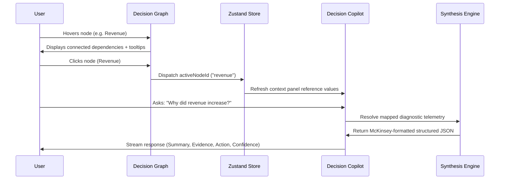
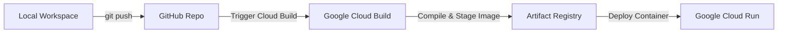

# SynapseIQ — AI-Powered Decision Intelligence Platform

> **Google GenAI Academy Hackathon Final Submission**
> Production-grade enterprise decision intelligence frontend architecture designed for high-stakes business optimization and risk forecasting, tailored to meet Google Cloud styling and architectural standards.

---

## 📖 Project Overview
SynapseIQ completely redesigns how executives interact with enterprise data. Moving beyond generic, passive dashboard grids, SynapseIQ acts as an **Advisory Control Room** and **Strategic Scenario Sandbox**. It enables Product Managers, CFOs, and Supply Chain Leads to understand interdependencies in business metrics, chat with an AI consultant, simulate critical operational pivots, and track progression milestones.

## ⚠️ Problem Statement
Modern enterprises are drowning in fragmented spreadsheets, disconnected BI dashboards, and siloed data silos.
1. **The "What" vs "Why" Gap:** Standard analytics tools show *what* metrics changed (e.g., "Revenue increased 18%") but fail to trace *why* (e.g., "Due to EU GDPR compliance validations converting accounts in Germany").
2. **Untestable Decisions:** Executives have to make multi-million-dollar supply chain pivots (like resourcing to Mexico) without a sandbox environment to instantly simulate risk and profit trade-offs.
3. **Passive Telemetry:** Generative AI is often tacked on as a generic floating chat widget that lacks page/node context and does not drive the dashboard workspace itself.

## 💡 The Solution
SynapseIQ implements a context-aware **Decision Intelligence Engine**:
1. **Interactive Decision Graph:** Visualizes core business nodes as a neural relationship network. Clicking any node alters the context of the entire dashboard.
2. **McKinsey-Style Strategy Copilot:** Context-aware assistant that structures strategy reports using detailed executive summaries, supporting evidence, confidence gauges, and action directives.
3. **AI Scenario Simulator:** Live slider controls allow managers to stress-test price adjustments, nearshoring pivots, and overhead cost shifts against projected margins in real time.

---

## 🗺️ Project Architecture & Documentation

### 📐 System Architecture Diagram
```mermaid
graph TD
    subgraph Client View [Vite + React SPA Shell]
        L[Landing Page / Intake] --> |Ingestion Sequence| EB[Executive Briefing]
        EB --> |Node Click Navigation| SC[Strategy Canvas]
        SC --> |Relational Filtering| BS[Business Signals]
        SC --> |Context Dispatch| CP[Decision Copilot]
        SC --> |Variables Sandbox| SM[Scenario Simulator]
        SC --> |Progressive Ledger| BT[Business Timeline]
    end

    subgraph State Control [Zustand Global Store]
        DS[useAppStore] --> |Active Node Context| EB
        DS --> |Dataset Metadata| CP
        DS --> |Scenario Inputs| SM
        DM[useDemoStore] --> |Timer & Step Ticks| CTL[DemoController]
    end

    subgraph Container Deployment [Google Cloud Run]
        DF[Dockerfile] --> |Multi-stage Node Compile| NX[Nginx Static Server]
    end

    style Client View fill:#151B23,stroke:rgba(255,255,255,0.08),stroke-width:1px
    style State Control fill:#1B222C,stroke:#79D38A,stroke-width:1px
    style Container Deployment fill:#0D1117,stroke:#A5E6B3,stroke-width:1px
```

### 🧬 Component Hierarchy
- `App.tsx` (HashRouter + Global DemoController mounting)
  - `Landing.tsx` (Intake Portal + UploadZone + Ingestion Sequence Loader)
  - `DashboardLayout.tsx` (Collapsible Sidebar + Topbar)
    - `ExecutiveBrief.tsx` (Greeting, Executive Summary, Circular Health, Top Opportunities, Risks)
    - `BusinessTimeline.tsx` (Storytelling Ledger + Category Filter Chips)
    - `BusinessSignals.tsx` (Telemetry Matrix + Dynamic Highlight States)
    - `StrategyCanvas.tsx` (DecisionGraph Centerpiece + Solvency Scatter Plot)
    - `DecisionCopilot.tsx` (Split-pane chat viewport + Context Reference sidebar)
    - `Forecast.tsx` (AI Scenario Simulator controls + Live Predictions + Comparative Cards)

### 🤖 AI Workflow Diagram


### 🚢 Deployment Workflow


---

## 🛠️ Technical Stack
*   **Runtime Framework:** React 19 + TypeScript (Strict Mode)
*   **Bundler Utility:** Vite 8
*   **Styling Engine:** Tailwind CSS v4 (Sleek dark theme, sage green active borders)
*   **State Management:** Zustand 5
*   **Graph Framework:** React Flow 12 (xyflow)
*   **Telemetry Charts:** Recharts 3
*   **Motion Transitions:** Framer Motion 12
*   **Icon Primitives:** Lucide React

---

## 📁 Folder Structure
```text
d:/Projects/SynapseIQ/
├── Dockerfile           # Multi-stage image build
├── nginx.conf           # SPA fallback routing configs
├── package.json         # NPM manifest & task scripts
├── tsconfig.json        # TypeScript configuration settings
├── src/
│   ├── assets/          # Static branding files
│   ├── components/      # Primtive UI elements & Centerpieces
│   │   ├── ui/          # Atomic buttons, cards, badges
│   │   ├── DecisionGraph.tsx   # Interactive React Flow relation map
│   │   ├── DemoController.tsx  # Guided Judge Tour UI Console
│   │   ├── Sidebar.tsx  # Dynamic sidebar collapsible panel
│   │   └── Topbar.tsx   # Status bar breadcrumb controls
│   ├── features/        # Global state and mock telemetry models
│   │   ├── data.ts      # Structured telemetry context mapping database
│   │   ├── demoStore.ts # Guided tour State Machine
│   │   └── store.ts     # Global workspace context store
│   ├── layouts/         # Layout wrappers
│   │   └── DashboardLayout.tsx
│   ├── pages/           # High-fidelity view interfaces
│   │   ├── Landing.tsx          # Upload portals
│   │   ├── ExecutiveBrief.tsx   # Executive Brief page
│   │   ├── BusinessTimeline.tsx # Storytelling ledger page
│   │   ├── BusinessSignals.tsx  # Telemetry matrices page
│   │   ├── StrategyCanvas.tsx   # Main Strategy Canvas
│   │   ├── DecisionCopilot.tsx  # Chat strategy room
│   │   └── Forecast.tsx         # AI Scenario Simulator
│   ├── App.tsx          # Root routing ledger
│   ├── index.css        # Typography design tokens
│   └── main.tsx         # React compiler entry mount
```

---

## 🚀 Installation & Local Development

### 1. Installation
Clone the repository and install dependencies:
```bash
npm install
```

### 2. Run Local Development Server
Start the local hot-reloading development server:
```bash
npm run dev
```

### 3. Production Build
Verify the type checks and compile the optimized production bundle:
```bash
npm run build
```

---

## ☁️ Google Cloud Run Deployment

This project includes a production-grade multi-stage `Dockerfile` and `nginx.conf` set up to deploy to Google Cloud Run statically:

### 1. Build and Tag Container Image
Using Google Cloud Build, submit the build directly to Artifact Registry:
```bash
gcloud builds submit --tag gcr.io/[PROJECT_ID]/synapseiq-app:latest
```

### 2. Deploy Container to Cloud Run
Deploy the compiled container image on Cloud Run, mapping exposed port 8080:
```bash
gcloud run deploy synapseiq-app \
  --image gcr.io/[PROJECT_ID]/synapseiq-app:latest \
  --platform managed \
  --region us-central1 \
  --allow-unauthenticated \
  --port 8080
```

---

## 📺 Guided Demo Experience
Designed specifically for Hackathon Judges who have under 3 minutes to evaluate the product. 
*   Simply click the **`🎥 Start Guided Demo`** button on the landing page.
*   The system will automatically guide you through a step-by-step progress loop, spotlighting relevant charts, loading live query mocks, and simulating pricing adjustments automatically.

---

## 🔮 Future Scope
1. **Dynamic Google BigQuery Integration:** Stream real-time operational telemetry logs directly into SynapseIQ.
2. **Multi-variable Monte Carlo Simulation:** Enable advanced stochastic projections within the Scenario Simulator.
3. **Vertex AI Gemini Workspace:** Integrate live Vertex AI endpoints to allow judges to upload arbitrary CSV files and construct custom relational graphs dynamically.

## 👥 Contributors
*   **SynapseIQ Product Architecture Team** — Pravalika (Design Lead & Staff Engineer)
