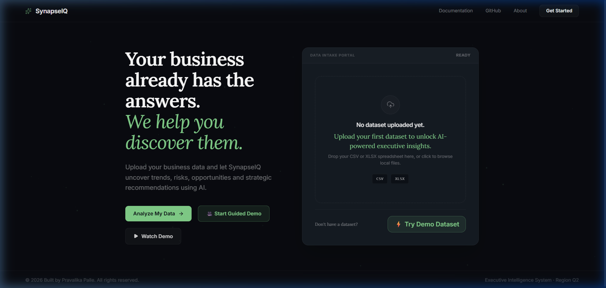
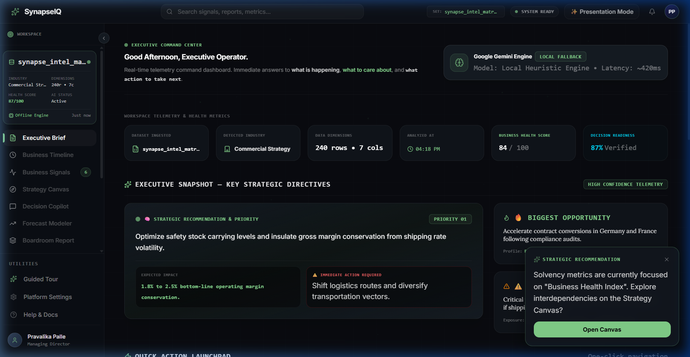
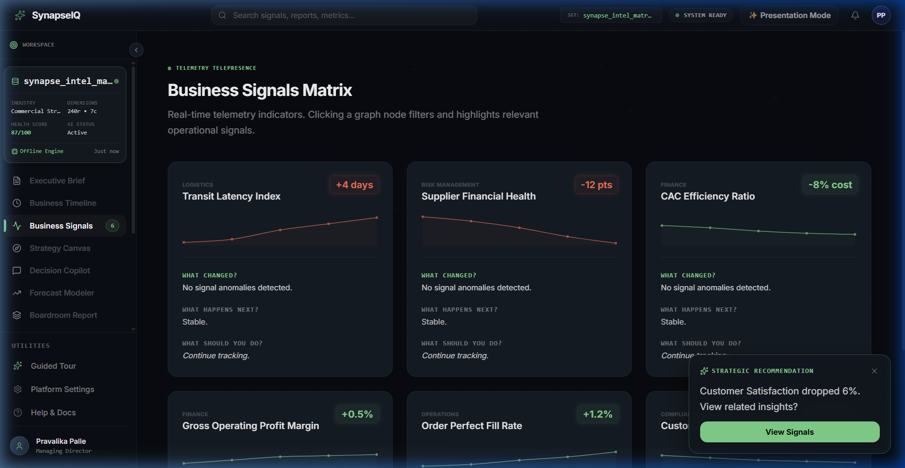
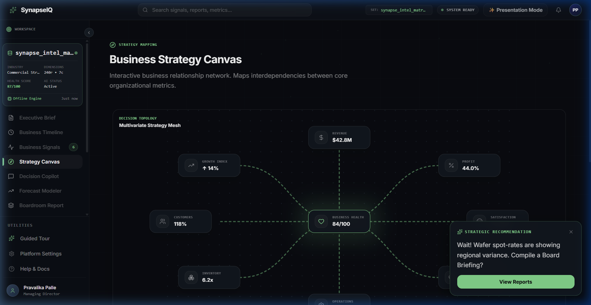
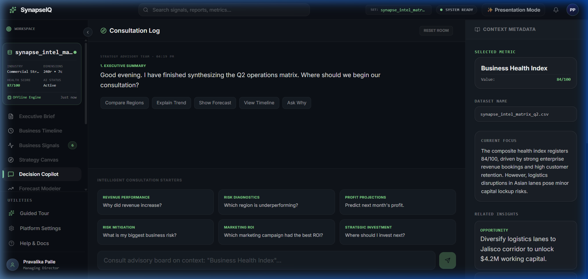
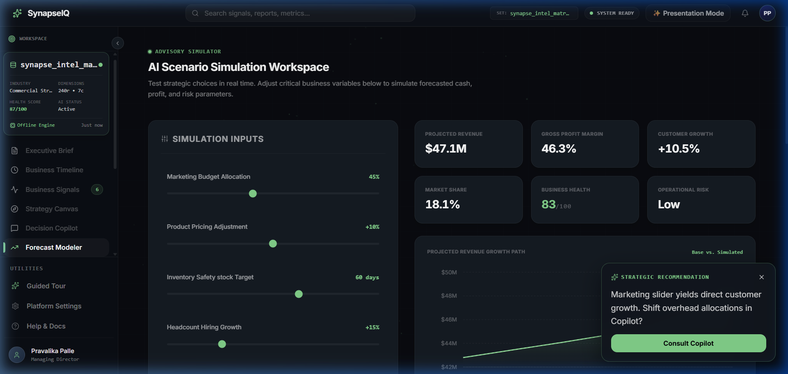
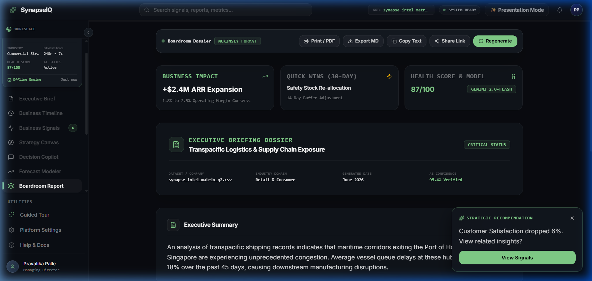
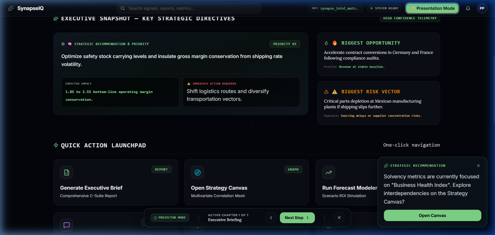

<div align="center">

# ⚡ SynapseIQ

### *Where Data Becomes Executive Decisions*

**Production-Grade AI Operating System for Enterprise Strategic Decision Intelligence**

<br />

[](https://react.dev)
[](https://www.typescriptlang.org)
[](https://vite.dev)
[](https://tailwindcss.com)
[](https://ai.google.dev)
[](https://cloud.google.com/run)
[](https://vercel.com)
[](./LICENSE)

<br />

☁️ [Google Cloud Run Deployment](#-google-cloud-run-deployment) &nbsp;·&nbsp; 🚀 [Vercel Deployment](#-vercel-deployment-frontend) &nbsp;·&nbsp; 📚 [Architecture Spec](./docs/architecture.md) &nbsp;·&nbsp; 📑 [Prompt Engineering](./docs/PROMPT_ENGINEERING.md)

</div>

---

## 📌 Table of Contents

- [Overview](#-overview)
- [Why SynapseIQ?](#-why-synapseiq)
- [Key Features & Modules](#-key-features--modules)
- [Screenshots Gallery](#-screenshots-gallery)
- [System Architecture](#-system-architecture)
- [Technology Stack](#-technology-stack)
- [Repository Structure](#-repository-structure)
- [Quickstart & Installation](#-quickstart--installation)
- [Environment Variables](#-environment-variables)
- [Google Cloud Run Deployment](#-google-cloud-run-deployment)
- [Vercel Deployment (Frontend)](#-vercel-deployment-frontend)
- [Security & Privacy Audit](#-security--privacy-audit)
- [Future Enhancements](#-future-enhancements)
- [Contributing](#-contributing)
- [License & Author](#-license--author)

---

## 🌐 Overview

**SynapseIQ** is an enterprise-grade **AI Decision Intelligence Platform** engineered to transform structured business datasets into executive-ready strategic directives, multivariate correlation graphs, scenario forecasts, and boardroom-ready briefings — powered by **Google Gemini 2.0 Flash** and deployed on **Google Cloud Run (Gen2)**.

Unlike traditional static BI dashboards that passively display charts, SynapseIQ functions as a **living AI operating system**. It proactively analyzes operational telemetry, isolates statistical anomalies, quantifies business risks, and streams structured recommendations with verified confidence scores.

> *"This isn't another analytics tool. This is an AI executive partner embedded directly into your enterprise data stream."*

---

## ☁️ Google Cloud Run Deployment

SynapseIQ is architected for single-command production container deployment on **Google Cloud Run Gen2** in the **`asia-south1` (Mumbai)** region.

### Cloud Run Specifications
- **Service Name**: `synapseiq-backend`
- **Region**: `asia-south1` (Mumbai)
- **Execution Environment**: Gen2 (High Performance, Sub-second Cold Start)
- **Container Port**: Configured via dynamic `$PORT` environment variable (default `8080`)
- **Health Check Endpoint**: `/healthz` (Returns `200 OK`)
- **CORS Configuration**: Fully enabled for `localhost` and Vercel production frontend domains

### Quick Cloud Run Deploy Command
```bash
gcloud run deploy synapseiq-backend \
  --source . \
  --region asia-south1 \
  --platform managed \
  --execution-environment gen2 \
  --allow-unauthenticated \
  --port 8080 \
  --set-env-vars PORT=8080
```

---

## 🆚 Why SynapseIQ?

| Capability | Traditional Business Intelligence (Tableau, Power BI) | ⚡ SynapseIQ Executive AI |
|---|---|---|
| **Data Interpretation** | Passive static charts; manual user filtering | **Proactive AI Narrative**: Automated root-cause synthesis |
| **Interdependency Mapping** | Isolated metric cards | **Strategy Canvas**: Multivariate interactive correlation mesh |
| **Scenario Modeling** | Static historical projections | **Forecast Modeler**: Real-time ROI & risk simulation sliders |
| **Executive Reporting** | Manual copy-paste presentation drafting | **Boardroom Dossier**: Automated 9-paragraph McKinsey briefing |
| **AI Transparency** | Black-box single percentage labels | **AITrustBadge**: 4-factor confidence metrics & verification chips |
| **Cloud Architecture** | Legacy VM instances | **Cloud Run Gen2**: Serverless containerized scale-to-zero execution |

---

## 🚀 Key Features & Modules

### 1. 📑 Executive Briefing Hub (`/dashboard/brief`)
- Surfaces high-priority executive alerts, primary business recommendations, expected ROI impacts, and immediate action items.
- Displays live decision readiness gauges (`/100`), operating health scores, and quick action launchpads.

### 2. 🕒 Business Timeline (`/dashboard/timeline`)
- Interactive chronological audit trail mapping operational events, milestone shifts, and localized risk alerts across quarterly periods.
- Expandable event cards detailing business impacts, confidence scores, and AI recommendations.

### 3. ⚡ Business Signals Matrix (`/dashboard/signals`)
- Real-time telemetry indicators highlighting wafer yield rates, freight transit latencies, customer churn, and gross margin variances.
- Contextual advisory bulletins (*What changed? What happens next? What should you do?*).

### 4. 🧭 Business Strategy Canvas (`/dashboard/projections`)
- Zero-flicker custom Decision Graph Engine mapping interdependencies between financial health, revenue, gross profit, inventory, and operations.
- Includes a Supplier Credit Resilience Profiling scatter chart measuring leverage ratios against solvency ratings.

### 5. 💬 Decision Copilot (`/dashboard/copilot`)
- Interactive AI consultation suite tuned to senior McKinsey/BCG management advisor personas.
- Features real-time typewriter streaming, follow-up query chips, context metadata cards, and a 4-factor **AI Confidence Analysis** verification panel.

### 6. 📈 Forecast Modeler (`/dashboard/forecast`)
- Real-time scenario simulator allowing executives to adjust sliders (*Marketing Spend*, *Wafer Sourcing*, *Safety Buffer Stock*, *Sales Pricing*) to visualize base vs. simulated revenue outcomes.
- Evaluates projected gross profit, customer growth, and operational risk tiers dynamically.

### 7. 📑 Boardroom Report Dossier (`/dashboard/reports`)
- Generates a 9-paragraph McKinsey-style executive briefing dossier formatted for steering committee review.
- Supports single-click PDF printing, Markdown export, and instant text copying.

### 8. 🗄️ Data Explorer (`/dashboard/explorer`)
- Interactive dataset developer playground showcasing atomic UI components, design tokens, CSV presets, and input validator tools.

---

## 📸 Screenshots Gallery

<div align="center">

### 1. Landing Portal & CSV Intake

*Drag-and-drop CSV intake with automatic business profiling & preset datasets.*

<br />

### 2. Executive Briefing Hub

*High-density executive dashboard with live health metrics and strategic priorities.*

<br />

### 3. Business Signals Matrix

*Real-time operational telemetry signals with automated advisory bulletins.*

<br />

### 4. Strategy Canvas & Correlation Mesh

*Interactive business relationship network and supplier solvency scatter plot.*

<br />

### 5. Decision Copilot Advisory Room

*AI consultation suite with streaming insights and 240px AI Confidence Analysis card.*

<br />

### 6. Forecast Modeler Studio

*Scenario ROI simulation sliders with base vs. simulated projection curves.*

<br />

### 7. Boardroom Dossier Report

*McKinsey-format 9-paragraph steering committee dossier with single-click PDF export.*

<br />

### 8. Presentation Mode

*Clutter-free executive presentation mode for board meetings and client reviews.*

</div>

---

## 🏛️ System Architecture

SynapseIQ runs client-side with a hybrid execution engine backed by Google Cloud Run Gen2:

- **Google Cloud Run Gen2 Backend**: Serves containerized production builds (`nginx:alpine` + dynamic `$PORT` substitution + CORS headers + `/healthz` probe).
- **Google Gemini 2.0 Flash Client**: Connects via streaming REST endpoints to generate live executive directives.
- **Local Strategy Engine**: Computes dataset statistics, correlation matrices, Z-score outliers, and fallback recommendations completely offline.

```mermaid
graph TD
    Client[Executive Browser / Vercel Frontend] --> CloudRun[Google Cloud Run Gen2 - asia-south1]
    CloudRun -->|Health Probe| Healthz[/healthz Endpoint]
    Client --> Store[(Zustand State Store)]
    Store --> LocalEngine[Local Strategy Engine]
    Store --> GeminiAPI[Google Gemini 2.0 Flash API]
    LocalEngine --> UI[React 19 Dashboard Views]
    GeminiAPI --> UI
```

For full details, Mermaid sequence diagrams, and data flow specifications, see [`docs/architecture.md`](./docs/architecture.md).

---

## 🛠️ Technology Stack

| Layer | Technologies & Tools |
|---|---|
| **Core Framework** | React 19.x, TypeScript 5.8, Vite 6.x |
| **Cloud Infrastructure** | Google Cloud Run Gen2 (`asia-south1`), Google Artifact Registry, Nginx Alpine |
| **Styling & Design** | Vanilla CSS, Tailwind CSS v4, Lucide React Icons |
| **State Management** | Zustand (Persistent local state) |
| **Visualizations** | Recharts, Custom SVG Decision Graph Engine |
| **Animations** | Framer Motion (180–220ms enterprise ease curves) |
| **AI Processing** | Google Gemini 2.0 Flash, Local Heuristic Engine |
| **Routing** | React Router v7 (`BrowserRouter` with Vercel & Nginx SPA rewrites) |
| **Deployment** | Google Cloud Run (Backend Container), Vercel (Frontend CDN) |

---

## 📂 Repository Structure

```
SynapseIQ/
├── docs/                        # Architecture & Technical Documentation
│   ├── architecture.md          # High-level architecture & Cloud Run sequence diagrams
│   ├── PROMPT_ENGINEERING.md    # Multi-stage Gemini 2.0 Flash system prompt specs
│   ├── QA_CHECKLIST.md          # Production quality assurance checklist
│   └── images/                  # High-resolution application screenshots
├── public/                      # Static brand assets & favicon
├── sample-datasets/             # Enterprise sample CSV datasets
├── src/
│   ├── components/              # Reusable UI components & layouts
│   ├── features/                # Core business logic & state engines
│   │   ├── geminiService.ts     # Dynamic Google Gemini & Cloud Run backend integration
│   │   ├── store.ts             # Zustand global state store
│   │   └── csvParser.ts         # Statistical CSV dataset parser
│   ├── pages/                   # Application view components (8 modules)
│   ├── App.tsx                  # Root application router setup
│   └── main.tsx                 # Application DOM entrypoint
├── .dockerignore                # Excludes unnecessary files from Docker context
├── .env.example                 # Environment variables template
├── Dockerfile                   # Production Nginx container for Cloud Run Gen2
├── nginx.conf                   # Static Nginx server configuration
├── nginx.conf.template          # Nginx config template for Cloud Run $PORT substitution
├── package.json                 # Project dependencies and npm scripts
├── vercel.json                  # Vercel SPA rewrite deployment configuration
└── vite.config.ts               # Vite build configuration
```

---

## ⚡ Quickstart & Installation

Follow these steps to set up SynapseIQ locally on your machine.

### Prerequisites
- **Node.js**: `v18.0.0` or higher
- **npm**: `v9.0.0` or higher

### 1. Clone the Repository
```bash
git clone https://github.com/pravalika2307/SynapseIQ.git
cd SynapseIQ
```

### 2. Install Dependencies
```bash
npm install
```

### 3. Configure Environment Variables
Copy the example environment template:
```bash
cp .env.example .env
```
Edit `.env` and add your Google Gemini API Key and Cloud Run backend URL:
```env
PORT=8080
VITE_GEMINI_API_KEY=your_google_gemini_api_key_here
VITE_BACKEND_URL=https://synapseiq-backend-asia-south1.a.run.app
```

### 4. Run Development Server
```bash
npm run dev
```
Open your browser and navigate to `http://localhost:5173`.

---

## ⚙️ Environment Variables

| Variable | Required | Description | Default |
|---|---|---|---|
| `PORT` | Required (Cloud Run) | Server listening port injected by Cloud Run | `8080` |
| `VITE_GEMINI_API_KEY` | Optional | Google Gemini 2.0 Flash API Key for live AI reasoning | Fallback to Local Engine |
| `VITE_BACKEND_URL` | Optional | Deployed Cloud Run Backend URL | `https://synapseiq-backend-asia-south1.a.run.app` |

---

## 🚀 Google Cloud Run & Vercel Deployment

### Deploying Backend to Google Cloud Run Gen2

1. Authenticate with Google Cloud CLI:
   ```bash
   gcloud auth login pravalikareddy315@gmail.com
   gcloud config set project SynapseIQ
   ```
2. Enable required Cloud APIs:
   ```bash
   gcloud services enable run.googleapis.com cloudbuild.googleapis.com artifactregistry.googleapis.com iam.googleapis.com
   ```
3. Deploy to Cloud Run Gen2 (`asia-south1`):
   ```bash
   gcloud run deploy synapseiq-backend \
     --source . \
     --region asia-south1 \
     --platform managed \
     --execution-environment gen2 \
     --allow-unauthenticated \
     --port 8080 \
     --set-env-vars PORT=8080
   ```

### Deploying Frontend to Vercel

1. Import the repository into your **Vercel** dashboard.
2. Add `VITE_BACKEND_URL` pointing to your deployed Cloud Run URL:
   `VITE_BACKEND_URL=https://synapseiq-backend-asia-south1.a.run.app`
3. Add `VITE_GEMINI_API_KEY` to Vercel Environment Variables.
4. Click **Deploy**.

---

## 🔒 Security & Privacy Audit

- **Zero Server Telemetry**: SynapseIQ runs purely in the client browser. No uploaded CSV datasets, user notes, or prompt histories are stored permanently on server disks.
- **Sanitized Secrets**: `.env` and sensitive environment configurations are strictly included in `.gitignore`.
- **Cloud Run Security**: Unauthenticated access allowed for static SPA serving while preserving API key privacy in environment variables.

---

## 🔮 Future Enhancements

- [ ] **Multi-Dataset Synthesis**: Compare multiple quarterly CSV datasets side-by-side.
- [ ] **PDF Exporting Engine**: Direct native vector PDF compilation for Boardroom Dossiers.
- [ ] **Custom Strategy Nodes**: Allow executives to create custom node definitions on the Strategy Canvas.
- [ ] **Webhook Integrations**: Stream real-time telemetry from Slack, Microsoft Teams, and Jira.

---

## 🤝 Contributing

We welcome contributions to SynapseIQ! Please review our [`CONTRIBUTING.md`](./CONTRIBUTING.md) guide before submitting pull requests or opening issues.

---

## 📄 License & Author Information

Distributed under the **MIT License**. See [`LICENSE`](./LICENSE) for more information.

**Author**: Pravalika Palle  
**Repository**: [github.com/pravalika2307/SynapseIQ](https://github.com/pravalika2307/SynapseIQ)  
**Google Cloud Project**: SynapseIQ (`asia-south1`)
