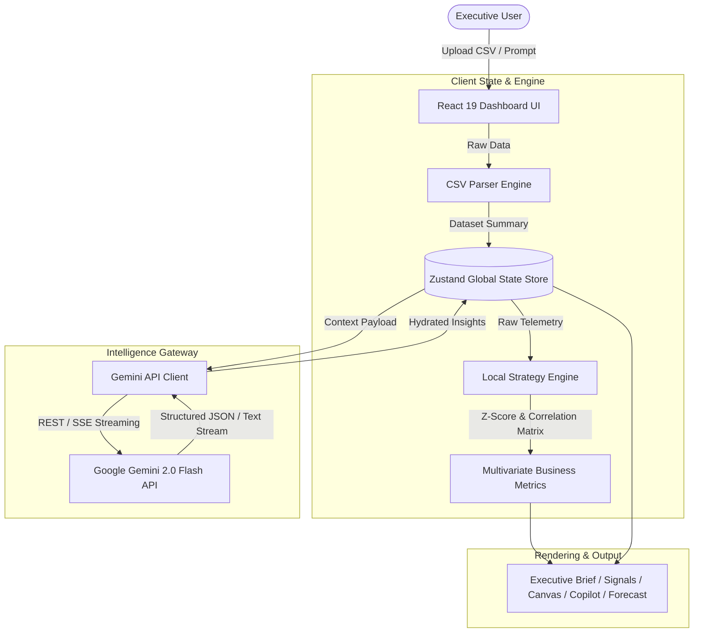
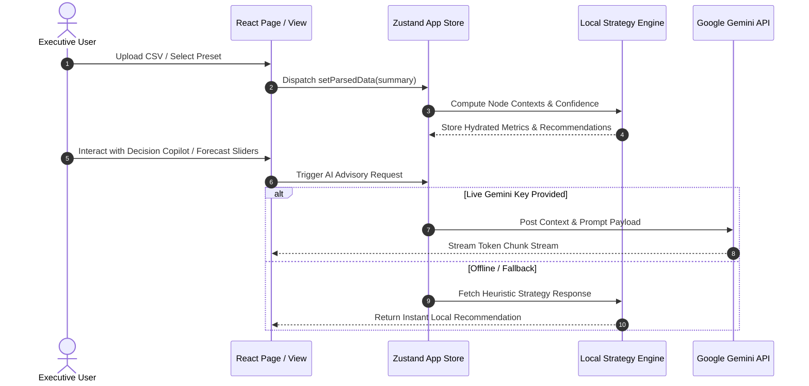
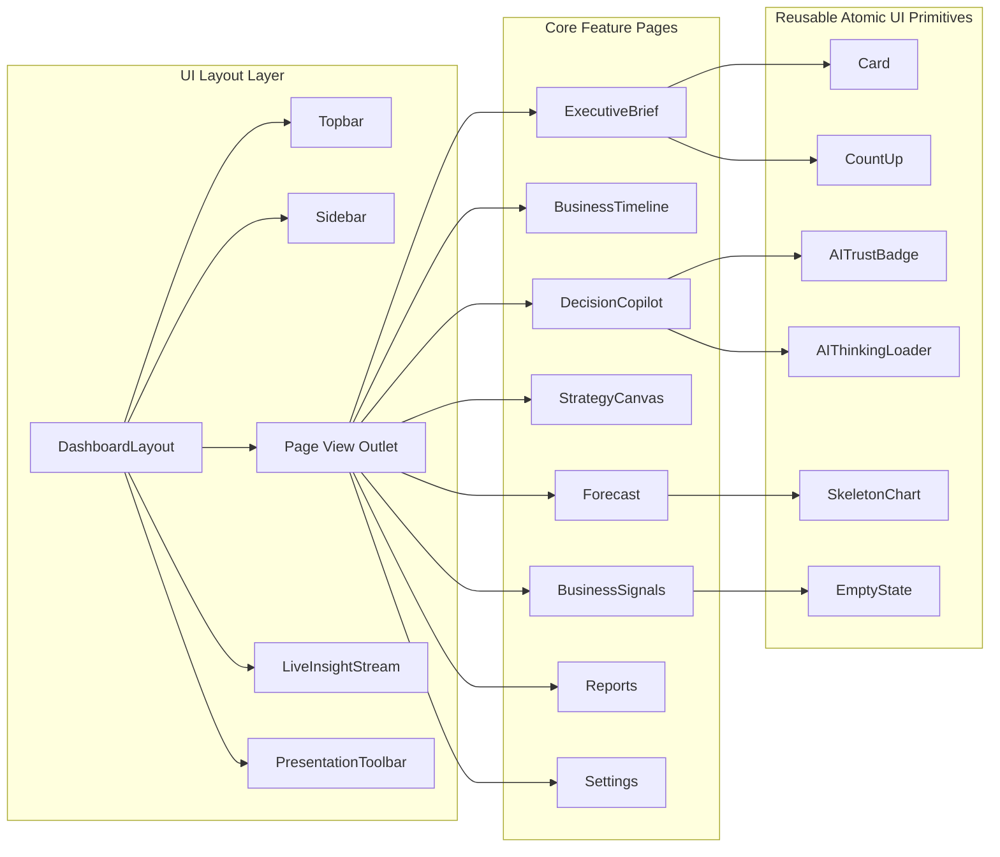
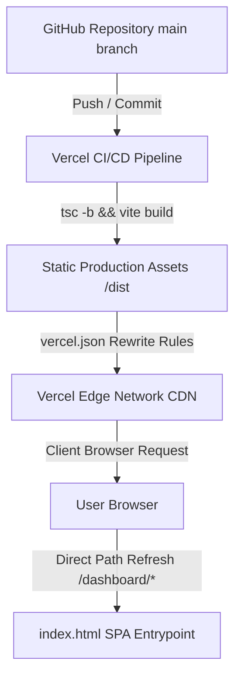

# SynapseIQ — System Architecture & Technical Specifications

This document outlines the high-level architecture, data processing flow, component interactions, AI reasoning pipeline, and deployment topology of **SynapseIQ**.

---

## 🏛️ High-Level System Architecture

SynapseIQ is built as a client-side enterprise Decision Intelligence engine powered by **React 19**, **TypeScript**, **Vite**, **Zustand**, and **Google Gemini 2.0 Flash**. The platform operates with a hybrid local-first processing architecture—enabling offline CSV parsing, multivariate statistical correlation calculation, and local heuristic analysis alongside optional live Gemini API reasoning.



---

## 🔄 Application Workflow

1. **Intake & Profiling**:
   - The user drags and drops a CSV dataset (or selects a sample dataset like *NovaRetail Q2 Matrix*).
   - `csvParser.ts` parses headers, calculates statistical summaries (mean, min, max, missing values, Z-score outliers), and identifies key metrics (revenue, expenses, churn, latency).
2. **Context Synthesis**:
   - The statistical engine generates `nodeContexts` for strategic metrics (*Revenue*, *Gross Profit*, *Inventory*, *Logistics Latency*, *Customer Satisfaction*).
3. **Interactive Advisory**:
   - The executive navigates between **Executive Brief**, **Business Signals Matrix**, **Strategy Canvas**, **Decision Copilot**, **Forecast Modeler**, and **Boardroom Report**.
4. **AI Reasoning Pipeline**:
   - User prompts in Decision Copilot or scenario adjustments in Forecast Modeler trigger structured query payloads sent to the Gemini Service (`geminiService.ts`).
   - If an API key is provided, live streaming Gemini 2.0 Flash responses render in real-time. If offline, the local strategy engine provides instant response fallbacks.



---

## 🧠 AI Reasoning Pipeline & Gemini Integration

SynapseIQ leverages a multi-stage prompt engineering pipeline (`PROMPT_ENGINEERING.md`) to format raw business telemetry into structured system prompts for Google Gemini 2.0 Flash.

### Prompt Construction
- **System Role**: Senior McKinsey / BCG Executive Business Partner & Decision Scientist.
- **Payload Structure**:
  ```json
  {
    "datasetProfile": { "industry": "Retail & Consumer", "rowCount": 240, "columns": 7 },
    "activeNodeContext": { "title": "Gross Profit Margin", "metric": "42.8%", "status": "Optimized" },
    "explorationHistory": ["Checked Vietnamese shipping queues", "Simulated Arizona wafer foundries"],
    "userQuery": "Why did revenue increase by 18% while profit only increased by 2%?"
  }
  ```
- **Response Format**: Enforced structured JSON output containing:
  - `recommendation`: Concise directive.
  - `businessReasoning`: Root cause analysis.
  - `supportingMetrics`: Quantified evidence.
  - `expectedImpact`: Financial ROI impact ($ or %).
  - `confidenceScore`: Statistical certainty rating (0-100%).

---

## ⚡ Component Interaction Architecture



---

## 🚀 Deployment & Production Architecture

SynapseIQ is configured for single-click deployment on **Vercel** with single-page application (SPA) client-side routing.



### Vercel Edge Rewrites (`vercel.json`)
```json
{
  "rewrites": [
    {
      "source": "/(.*)",
      "destination": "/index.html"
    }
  ]
}
```

---

## 🔒 Security & Privacy Architecture

- **Zero Server Storage**: All uploaded datasets, CSVs, and prompt interactions remain strictly within the user's browser memory via local Zustand state.
- **Client-Side API Key Authorization**: Users enter their Google Gemini API key directly into client settings or environment variables (`VITE_GEMINI_API_KEY`). API keys are never stored on external databases or telemetry servers.
